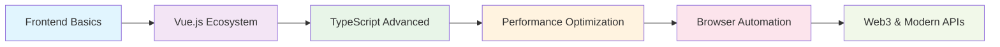

<div align="center">
  
</div>

<div align="center">
  
</div>

<div align="center">

[](https://linkedin.com/in/hj01857655)
[](https://hj01857655.github.io)
[](https://twitter.com/hj01857655)
[](mailto:1292548381@qq.com)

</div>

## 🚀 About Me

> 💭 I may be slow to respond, but I'm always coding with passion!

- 🏢 Working at **Zhubajie Network Technology Co., Ltd.**
- 📍 Based in **ChangSha, China**
- 💻 Passionate about **Frontend Development** and **Open Source**
- 🌱 Currently exploring **Modern Web Technologies**
- 🎯 Always eager to learn and contribute to the community

## 🛠️ Tech Stack

<div align="center">

### 🎨 Frontend Technologies


### 🎭 UI Frameworks & Libraries


### 🛠️ Development Tools


### 🦀 Systems Programming & Desktop Apps


### 🌐 Browser & Automation


</div>

## 📊 GitHub Analytics

<div align="center">
  
  
</div>

<div align="center">
  
</div>

<div align="center">
  
</div>

<div align="center">
  
</div>

## 🏆 GitHub Trophies

<div align="center">
  
</div>

## 📈 Contribution Graph

<div align="center">
  
</div>

## 🔥 Featured Projects

<table>
<tr>
<td width="50%">

### 🚀 Featured Projects

**[XMail - 邮件管理系统](https://github.com/hj01857655/XMail)**
- 🛠️ **Tech**: Rust + Tauri + Vue.js 3 + SQLite
- 📝 **Description**: 现代化跨平台桌面邮件管理应用
- ⭐ **Features**:
  - 🚀 跨平台支持 (Windows/macOS/Linux)
  - ⚡ Rust 后端高性能
  - 💻 Vue.js 响应式界面
  - 📊 实时统计和搜索功能

**[Augment Token Manager](https://github.com/hj01857655/augment-token-mng)**
- 🛠️ **Tech**: Rust + Tauri 2.0 + Vue 3 + OAuth 2.0
- 📝 **Description**: Augment Code 访问令牌管理工具
- ⭐ **Features**:
  - 🔐 PKCE OAuth 2.0 安全认证
  - 💾 本地加密存储
  - 📊 实时状态检查和余额监控
  - ⚡ HTTP连接池优化

</td>
<td width="50%">

### 🔧 Browser Automation

**[ScriptCat](https://github.com/hj01857655/ScriptCat)**
- 🛠️ **Tech**: JavaScript, Browser APIs
- 📝 **Description**: Custom userscripts collection for browser automation
- ⭐ **Features**:
  - User interface automation
  - Web scraping utilities
  - Browser extension development

### 🍴 Learning & Research

**[claude-code-reverse](https://github.com/hj01857655/claude-code-reverse)**
- 🔍 **Focus**: Reverse Engineering & Analysis
- 💡 **Learning**: LLM code analysis techniques

**[ant-design](https://github.com/hj01857655/ant-design)**
- 🎨 **UI/UX**: React component library
- 📚 **Study**: Enterprise-class UI design patterns

</td>
</tr>
</table>

### 📚 Learning & Research Projects

<details>
<summary>🔬 <strong>Technical Exploration</strong></summary>

- **[SHST](https://github.com/hj01857655/SHST)** - Educational Management System
  - 🏫 **Domain**: Educational Technology
  - 🛠️ **Tech**: Vue.js, API Integration
  - 📱 **Features**: Student information management, course scheduling

- **[video.min.js](https://github.com/hj01857655/video.min.js)** - Minimal Video Player
  - 🎥 **Media**: Video streaming optimization
  - ⚡ **Performance**: Lightweight player implementation
  - 🔧 **Customization**: Modular video controls

- **[layui](https://github.com/hj01857655/layui)** - UI Framework Study
  - 🎨 **UI**: Component-based design system
  - 📐 **Layout**: Responsive grid systems
  - 🔄 **Integration**: Backend integration patterns

</details>

## 🎨 Skills & Expertise

### 💻 Programming Languages & Frameworks
<div align="center">

| Technology | Proficiency | Experience | Projects |
|------------|-------------|------------|----------|
|  | ████████░░ 80% | 3+ years | Browser Automation, Frontend |
|  | ███████░░░ 70% | 1+ years | Desktop Apps, System Programming |
|  | ████████░░ 80% | 2+ years | XMail, Token Manager |
|  | ███████░░░ 70% | 2+ years | Type-safe Development |
|  | ███████░░░ 70% | 1+ years | Cross-platform Desktop Apps |
|  | █████████░ 90% | 4+ years | Responsive Web Design |

</div>

### 🛠️ Development Philosophy

```javascript
const hj01857655 = {
    code: ["JavaScript", "TypeScript", "Rust", "Vue.js"],
    frameworks: ["Tauri", "Vue 3", "Vite"],
    tools: ["VS Code", "Git", "Chrome DevTools", "Cargo"],
    architecture: ["Desktop Apps", "SPA", "Cross-platform", "Responsive Design"],
    currentFocus: "Rust + Tauri Desktop Development & Browser Automation",
    specialties: ["OAuth 2.0", "Desktop GUI", "System Programming", "Token Management"],
    learningGoals: ["Advanced Rust", "WebAssembly", "Performance Optimization"],
    workStyle: "Collaborative, Detail-oriented, Continuous Learning",
    funFact: "I love building cross-platform apps with Rust! 🦀"
};
```

### 🎯 Current Learning Path

<div align="center">



</div>

### 🌟 Areas of Interest
- 🦀 **Rust Systems Programming & Desktop Apps**
- 🔧 **Cross-platform Development with Tauri**
- 🔐 **OAuth 2.0 & Security Implementation**
- 🔧 **Browser Automation & Userscripts**
- 🎨 **Modern UI/UX Design Systems**
- ⚡ **Performance Optimization & Memory Safety**
- 📱 **Responsive Web Development**
- 🔍 **Code Analysis & Reverse Engineering**

## 📫 Let's Connect!

<div align="center">
  
[](https://github.com/hj01857655)
[](mailto:1292548381@qq.com)

</div>

## 💡 Random Dev Quote

<div align="center">
  
</div>

## 📈 Recent Activity

<!--START_SECTION:activity-->
1. 🗣 Commented on [#6](https://github.com/hj01857655/kiro-account-manager/issues/6#issuecomment-3689164136) in [hj01857655/kiro-account-manager](https://github.com/hj01857655/kiro-account-manager)
2. 🗣 Commented on [#3](https://github.com/hj01857655/kiro-account-manager/issues/3#issuecomment-3664107166) in [hj01857655/kiro-account-manager](https://github.com/hj01857655/kiro-account-manager)
3. 🗣 Commented on [#2](https://github.com/hj01857655/kiro-account-manager/issues/2#issuecomment-3644770735) in [hj01857655/kiro-account-manager](https://github.com/hj01857655/kiro-account-manager)
4. 🗣 Commented on [#1](https://github.com/hj01857655/kiro-account-manager/issues/1#issuecomment-3623961198) in [hj01857655/kiro-account-manager](https://github.com/hj01857655/kiro-account-manager)
5. 🚀 Published release [Kiro Token Manager v1.0.7](https://github.com/hj01857655/kiro-account-manager/releases/tag/v1.0.7) in [hj01857655/kiro-account-manager](https://github.com/hj01857655/kiro-account-manager)
<!--END_SECTION:activity-->

## 🎵 Currently Listening

[](https://open.spotify.com/user/hj01857655)

## ⏰ Coding Time This Week

<!--START_SECTION:waka-->
```text
JavaScript   8 hrs 32 mins   ████████████░░░░░░░░░░░░░   48.2%
TypeScript   4 hrs 15 mins   ██████░░░░░░░░░░░░░░░░░░░   24.1%
Vue.js       3 hrs 22 mins   ████░░░░░░░░░░░░░░░░░░░░░   19.1%
CSS          1 hr 28 mins    ██░░░░░░░░░░░░░░░░░░░░░░░    8.3%
HTML         0 hrs 3 mins    ░░░░░░░░░░░░░░░░░░░░░░░░░    0.3%
```
<!--END_SECTION:waka-->

## 🎯 2024-2025 Goals

- [x] 🚀 Master Vue 3 Composition API
- [x] 📱 Build responsive web applications
- [x] 🦀 Learn Rust systems programming
- [x] 🖥️ Build cross-platform desktop apps with Tauri
- [x] 🔐 Implement OAuth 2.0 security standards
- [ ] 🤖 Learn AI/ML integration in web apps
- [ ] 🌐 Contribute to 5 open source projects
- [ ] 📚 Write technical blog posts about Rust & Tauri
- [ ] 🎨 Master advanced CSS animations
- [ ] 🔧 Explore WebAssembly with Rust

## 🎮 Fun Zone

<div align="center">

### 🐍 Snake Game (Contribution Graph)
<picture>
  <source media="(prefers-color-scheme: dark)" srcset="https://raw.githubusercontent.com/hj01857655/hj01857655/output/github-contribution-grid-snake-dark.svg">
  <source media="(prefers-color-scheme: light)" srcset="https://raw.githubusercontent.com/hj01857655/hj01857655/output/github-contribution-grid-snake.svg">
  
</picture>

### 🎲 Random Joke


</div>

---

<div align="center">
  
</div>

<div align="center">
  
  
  

  <br><br>

  **Thanks for visiting! 😊 Let's connect and build something amazing together!**

  <br>

  *"The best way to predict the future is to create it."* – Peter Drucker

  <br><br>

  ⭐ **If you like my work, please consider giving a star!** ⭐

</div>
