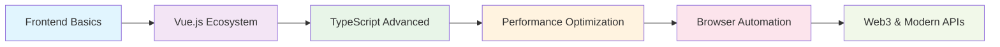

# 👋 Hi there, I'm hj01857655!

<div align="center">
  
</div>

## 🚀 About Me

> 💭 I may be slow to respond, but I'm always coding with passion!

- 🏢 Working at **Zhubajie Network Technology Co., Ltd.**
- 📍 Based in **ChangSha, China**
- 💻 Passionate about **Frontend Development** and **Open Source**
- 🌱 Currently exploring **Modern Web Technologies**
- 🎯 Always eager to learn and contribute to the community

## 🛠️ Tech Stack

### Frontend


### UI Frameworks


### Tools & Others


## 📊 GitHub Stats

<div align="center">
  
  
</div>

<div align="center">
  
</div>

## 🏆 GitHub Trophies

<div align="center">
  
</div>

## 📈 Contribution Graph

<div align="center">
  
</div>

## 🔥 Featured Projects

<table>
<tr>
<td width="50%">

### 🎯 Personal Projects
**[ScriptCat](https://github.com/hj01857655/ScriptCat)**
- 🛠️ **Tech**: JavaScript, Browser APIs
- 📝 **Description**: Custom userscripts collection for browser automation and enhancement
- ⭐ **Features**:
  - User interface automation
  - Web scraping utilities
  - Browser extension development

</td>
<td width="50%">

### 🍴 Notable Contributions
**[claude-code-reverse](https://github.com/hj01857655/claude-code-reverse)**
- 🔍 **Focus**: Reverse Engineering & Analysis
- 💡 **Learning**: LLM code analysis techniques

**[ant-design](https://github.com/hj01857655/ant-design)**
- 🎨 **UI/UX**: React component library
- 📚 **Study**: Enterprise-class UI design patterns

</td>
</tr>
</table>

### 📚 Learning & Research Projects

<details>
<summary>🔬 <strong>Technical Exploration</strong></summary>

- **[SHST](https://github.com/hj01857655/SHST)** - Educational Management System
  - 🏫 **Domain**: Educational Technology
  - 🛠️ **Tech**: Vue.js, API Integration
  - 📱 **Features**: Student information management, course scheduling

- **[video.min.js](https://github.com/hj01857655/video.min.js)** - Minimal Video Player
  - 🎥 **Media**: Video streaming optimization
  - ⚡ **Performance**: Lightweight player implementation
  - 🔧 **Customization**: Modular video controls

- **[layui](https://github.com/hj01857655/layui)** - UI Framework Study
  - 🎨 **UI**: Component-based design system
  - 📐 **Layout**: Responsive grid systems
  - 🔄 **Integration**: Backend integration patterns

</details>

## 🎨 Skills & Expertise

### 💻 Programming Languages
<div align="center">

| Language | Proficiency | Experience |
|----------|-------------|------------|
|  | ████████░░ 80% | 3+ years |
|  | ███████░░░ 70% | 2+ years |
|  | ████████░░ 80% | 2+ years |
|  | █████████░ 90% | 4+ years |

</div>

### 🛠️ Development Philosophy

```javascript
const hj01857655 = {
    code: ["JavaScript", "TypeScript", "Vue", "React"],
    tools: ["VS Code", "Git", "Chrome DevTools", "ScriptCat"],
    architecture: ["SPA", "Component-based", "Responsive Design"],
    currentFocus: "Modern Frontend Development & Browser Automation",
    learningGoals: ["Advanced TypeScript", "Performance Optimization", "Web3"],
    workStyle: "Collaborative, Detail-oriented, Continuous Learning",
    funFact: "I debug with console.log() and I'm not ashamed! 😄"
};
```

### 🎯 Current Learning Path

<div align="center">



</div>

### 🌟 Areas of Interest
- 🔧 **Browser Automation & Userscripts**
- 🎨 **UI/UX Design Systems**
- ⚡ **Frontend Performance Optimization**
- 📱 **Responsive Web Development**
- 🔍 **Code Analysis & Reverse Engineering**

## 📫 Let's Connect!

<div align="center">
  
[](https://github.com/hj01857655)
[](mailto:your-email@example.com)

</div>

## 💡 Random Dev Quote

<div align="center">
  
</div>

---

<div align="center">
  
  
  **Thanks for visiting! 😊**
  
  *"Code is like humor. When you have to explain it, it's bad."* – Cory House
</div>
